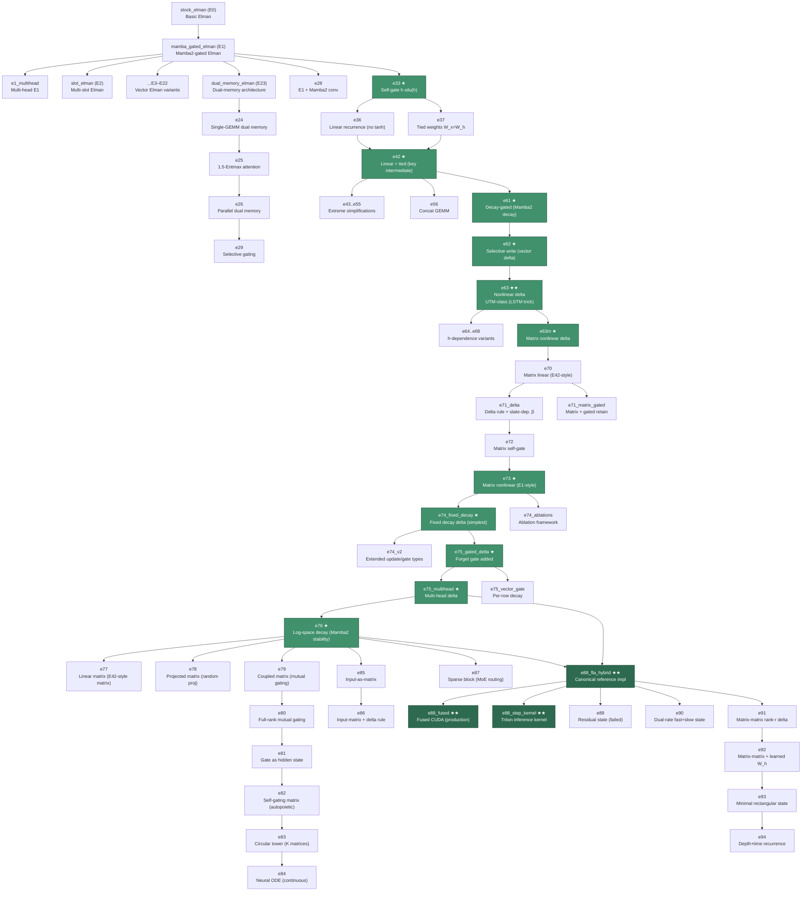

# Emender Model Zoo

Architecture-search ablation trail that led to Emender/E88.
All 119 `.py` files in `ndm/models/` are documented here.

---

## Roll-up Counts

| Class | Count | Description |
|-------|-------|-------------|
| **canonical** | 3 | Production Emender/E88 implementations |
| **baseline** | 10 | Comparison models (transformers, SSMs, classic RNNs) |
| **ablation** | 96 | Architecture-search variants in the E0→E88 lineage |
| **retired** | 6 | Superseded implementation variants kept for reproducibility |
| **infrastructure** | 4 | LM wrappers, Triton ops, package init (not model architectures) |
| **Total** | **119** | `ls ndm/models/*.py \| wc -l` = 119 ✓ |

---

## Lineage Diagram

The architecture search proceeded through six phases. The critical path is:
`stock_elman → E1 → E33 → E42 → E61 → E62 → E63 → E63m → E74 → E75_multihead → E76 → E88`

**Key milestones** (★★ = canonical, ★ = critical path):
- **E63** — First UTM-class gated recurrence; applies LSTM trick (nonlinear h in value) to delta update.  See `docs/E63_NONLINEAR_DELTA_DESIGN.md`.
- **E74_fixed_decay** — Simplest workable matrix delta rule; base of the autopoietic ladder.
- **E75_multihead** — Multi-head delta (H independent n×n states); direct ancestor of E88.
- **E76** — Adds Mamba2-style log-space decay for training stability.
- **E88_fla_hybrid** — Converges FLA-GDN design elements (Mamba2 decay, conv, L2-norm) with nonlinear matrix state; the production architecture. See `docs/E88_ABLATION_NOTES.md`.

---

## Classification Table

Columns: `file | class | series-id | predecessor | what was tested | result/notes`

### Canonical (3)

| File | Class | Series | Predecessor | Description | Result |
|------|-------|--------|-------------|-------------|--------|
| `e88_fla_hybrid.py` | canonical | E88 | E75_multihead + E76 | Production Emender/E88: Mamba2-style decay, L2-norm, multi-head nonlinear delta memory with tanh, no conv, no output norm | Avg100 ≈ 1.695 (E88c_nogate config); see ablation notes |
| `e88_fused.py` | canonical | E88 | e88_fla_hybrid | Fully fused CUDA kernel; 5–6× faster than baseline, register-owned backward for n_state≤32 | Production kernel |
| `e88_step_kernel.py` | canonical | E88 | e88_fused | Triton single-token step kernel fusing ~20 kernel launches into 1 | Inference kernel |

### Baselines (10)

| File | Class | Series | Description |
|------|-------|--------|-------------|
| `llama_baseline.py` | baseline | — | Llama-style transformer (RMSNorm, RoPE, SwiGLU, causal attention / Flash Attention) |
| `mamba2_baseline.py` | baseline | — | Mamba2 wrapper from `mamba_ssm`; primary selective-SSM baseline |
| `m2rnn_baseline.py` | baseline | — | M2RNN (Mishra et al.): `z=tanh(hW + kv^T)`, `h=f*h+(1-f)*z`; uses XMA Triton kernel |
| `fla_gated_delta.py` | baseline | — | FLA GatedDeltaNet (ICLR 2025) wrapper; primary linear-time gated-delta baseline |
| `gated_delta_net.py` | baseline | — | GatedDeltaNet pure-PyTorch + FLA wrapper (second GDN entry-point for debugging) |
| `gru_baseline.py` | baseline | — | Standard GRU via PyTorch cuDNN; classic nonlinear RNN baseline |
| `lstm_baseline.py` | baseline | — | Standard LSTM via PyTorch cuDNN; 4-gate classic baseline |
| `min_rnn_baseline.py` | baseline | — | minGRU and minLSTM (Feng et al. 2024); minimal RNNs with parallel training |
| `cuda_gru.py` | baseline | — | Custom CUDA GRU kernel (BF16 optimized); avoids cuDNN BF16 regression |
| `cuda_lstm.py` | baseline | — | Custom CUDA LSTM kernel (BF16 optimized); avoids cuDNN BF16 regression |

### Infrastructure (4)

| File | Class | Description |
|------|-------|-------------|
| `__init__.py` | infrastructure | Package init |
| `ladder_lm.py` | infrastructure | LadderLM: residual+RMSNorm wrapper that runs any E-series cell |
| `hybrid_ladder.py` | infrastructure | HybridLadderLM: per-layer architecture selection (e.g., alternating E88/FLA) |
| `triton_ops.py` | infrastructure | Fused Triton kernels for E88 (SiLU+L2-norm, outer-product update) |

### Retired (6)

Files that are superseded by cleaner or faster variants of the same model.

| File | Class | Series | Predecessor | Why retired |
|------|-------|--------|-------------|-------------|
| `stock_elman.py` | retired | E0 | — | Original Elman with separate gate projection; superseded by E1 (Mamba2-style split) |
| `e37_tied_weights.py` | retired | E37 | E33 | Slow version (computes W@(x+h) per step); superseded by e37_tied_weights_v2 |
| `dual_memory_elman_optimized.py` | retired | E23 | E23 | BMM-based attention optimization for E23; the optimization was folded into cleaner code |
| `dual_memory_elman_triton.py` | retired | E23 | E23 | Triton kernel experiment for E23 tape ops; abandoned (architecture path not pursued) |
| `dual_memory_elman_chunked.py` | retired | E23c | E23 | Chunked decoupling of tape reads for batching; not used (dual-memory path dropped) |
| `e74_ablations.py` | retired | E74 | E73 | Multi-variant ablation testing harness (state/proj/nonlin/gate types); replaced by e74_fixed_decay + e74_v2 |

---

### Ablations (96)

Organized by phase of the architecture search.

#### Phase 1 — Early Vector Elman (E0–E23, unnumbered era)

The unnumbered files map to early E-series numbers documented in the codebase.

| File | Series | Predecessor | What was tested | Result/notes |
|------|--------|-------------|-----------------|--------------|
| `mamba_gated_elman.py` | E1 | E0 | Mamba2-style split projection gating: `x,z=split(proj(x))`, `output=h*silu(z)` | Founding architecture; all subsequent vector ablations branch from here |
| `e1_multihead.py` | E1-mh | E1 | H independent vector-state Elman heads, each n_state-wide, batched GEMMs | Intermediate step toward multi-head matrix state |
| `slot_elman.py` | E2 | E1 | Multi-slot: n_slots independent hidden states batched into one GEMM | n_slots × more memory capacity at ~same compute |
| `lowrank_slot_elman.py` | E3 | E2 | Low-rank W_h per slot (U_s @ V_s); each slot has unique O(2dr) dynamics | Fewer params than E2 with per-slot specialization |
| `lowrank_elman.py` | E4 | E1 | SVD-style low-rank W_h = U @ V; O(2dr) recurrence vs O(d²) | Parameter reduction; memory efficiency |
| `pure_lowrank_elman.py` | E5 | E4 | No in_proj/out_proj; all matrices factored as U @ V on full dim | Enables 252 layers at 50M params (vs 38 for E1) |
| `diagonal_elman.py` | E6 | E1 | Per-channel EMA (diagonal recurrence) + low-rank cross-channel mix | O(dim) recurrence enables 743 layers at 50M params |
| `circulant_elman.py` | E6-circ | E6 | Circulant FFT matrix via `IFFT(FFT(c)*FFT(v))`; n params vs n² | O(n log n) recurrence; FFT is GPU-efficient |
| `monarch_elman.py` | E7 | E1 | Monarch matrix (two block-diagonals via permute): O(n√n) recurrence | 64× fewer FLOPs theoretically at n=4096 |
| `scaled_lowrank_elman.py` | E8 | E4 | Learned importance scales on low-rank factors (`diag(s)` between U and V) | Implicit sparsification via learned rank selection |
| `hybrid_elman.py` | E9 | E1 | Small dense core (full W_h) + large diagonal memory bank | Dense core for dynamics, cheap linear long-range storage |
| `multiscale_elman.py` | E10 | E1 | Multiple EMA banks at different timescales; zero extra GEMMs per bank | Multi-resolution memory without added computation |
| `selective_elman.py` | E11 | E10 | Mamba-style input-dependent decay per bank; selective read via softmax | Input selectivity on multi-scale memory |
| `selective_gated_elman.py` | E12 | E1 | Output gate depends on h: `gate=sigmoid(z+W_g@h)` | Hidden-state-dependent selective gating |
| `matrix_state_elman.py` | E14 | E1 | Matrix hidden state H∈ℝ^(d×k) with outer-product update and decay | Trading weight capacity for state capacity |
| `diagonal_state_elman.py` | E16 | E1 | Mamba2-style expanded diagonal state: `h'=tanh(A⊙h+B@x)`, C projects out | State expansion with diagonal recurrence |
| `selective_wh_elman.py` | E17 | E1 | Input-dependent gate on recurrence: `(W_h@h)*sigmoid(W_gate@x)` | Diagonal selectivity on dense W_h (Mamba2-style A) |
| `haware_gate_elman.py` | E18 | E1 | h-aware output gate: `output=h*silu(z+h)` (free, no extra params) | h-awareness in output gating |
| `simplified_gate_elman.py` | E19 | E18 | Remove W_gate, reuse W_x: `gate=silu(Wx+h+b_gate)` | −d² params; tests if W_gate is needed |
| `mamba2_informed_elman.py` | E20 | E1 | Apply Mamba2 lessons: per-head scalar decay, combined in_proj, no state tanh | Applies Mamba2 parameterization to Elman |
| `structured_elman.py` | E21 | E1 | MIMO rank-R state update with SiLU nonlinearity: `H=SiLU(α*H+B@X^T)` | Nonlinear state transition for "attractor basins" |
| `structured_elman_attention.py` | E22 | E21 | E21 + periodic state self-attention every K steps for UTM-class routing | State-dependent routing for full expressivity |
| `dual_memory_elman.py` | E23 | E1 | Tape (N slots linear storage) + working memory (small nonlinear); attention read/write | Separate long-term tape from nonlinear compute |
| `softsign_elman.py` | E1-ss | E1 | softsign(x)=x/(1+|x|) instead of tanh; cheaper, smoother gradient | Alternative bounded activation; cheaper exp-free |

#### Phase 2 — Dual-Memory Branch (E24–E29)

| File | Series | Predecessor | What was tested | Result/notes |
|------|--------|-------------|-----------------|--------------|
| `e24_single_gemm.py` | E24 | E23 | Fuse h_work+x into single [2D,2D] GEMM; write_val sees both h and x | Single GEMM efficiency; more expressive write |
| `e25_entmax.py` | E25 | E23 | Replace softmax tape attention with 1.5-entmax (sparse, closed-form) | Sparse attention; exact zeros for low-scoring slots |
| `e26_parallel.py` | E26 | E24 | Pre-compute all W_x projections in one batched GEMM; attention is cheap O(N×D) | Separates content (GEMM) from routing (attention) |
| `e29_selective.py` | E29 | E26 | Selective output gate depending on z, read, and h_work_new | E26 + Mamba-style selective output |
| `e29c_diagonal.py` | E29c | E29 | SSM-style diagonal gate: 4×D params instead of 3×D² for gate matrix | Same selectivity as E29b at 1/768 the param cost |

#### Phase 3 — Vector Elman Simplification Ablations (E28–E60)

All ablations in this phase use E1 or E33 as the reference model.

| File | Series | Predecessor | What was tested | Result/notes |
|------|--------|-------------|-----------------|--------------|
| `e28_conv_elman.py` | E28 | E1 | Add Mamba2's depthwise causal conv1d (k=4) before recurrence | Tests local context via conv |
| `e30_diagonal_gated.py` | E30 | E1 | SSM-style diagonal gate on output: `gate=silu(z*g_z+h*g_h+b)` | Input-dependent selectivity with 3×d_inner params |
| `e31_sparse_gated.py` | E31 | E1 | Sparse output gate via ReLU/softplus instead of silu | Zero-sparsity gating; "register-like" behavior |
| `e32_no_presilu.py` | E32 | E1 | Remove pre-SiLU activation from input branch | Tests importance of pre-activation |
| `e33_self_gate.py` | E33 | E1 | Self-gate: `output=h*silu(h)` instead of `h*silu(z)` | No z branch needed; key step toward E42 |
| `e34_diagonal_wh.py` | E34 | E33 | Replace W_h∈ℝ^(d×d) with per-dim scalar d∈ℝ^d; removes per-step GEMM | O(dim) vs O(dim²) recurrence |
| `e35_cubic_gate.py` | E35 | E33 | Cubic gate `output=h³` instead of `h*silu(h)` | Tests if sigmoid is necessary |
| `e36_linear_recurrence.py` | E36 | E33 | Remove tanh from recurrence: `h=W_x@x+W_h@h+b` (linear); needs spectral norm | Linear recurrence for gradient flow |
| `e37_tied_weights_v2.py` | E37v2 | E37 | Optimized tied weights: pre-compute W@x batched, sequential W@h only | ~52% speedup over E37 at same math |
| `e38_no_wx.py` | E38 | E33 | Remove W_x: `h=tanh(x_proj+W_h@h+b)` (direct add, no W_x) | One fewer d×d matrix; tests W_x necessity |
| `e39_no_bias.py` | E39 | E38 | Remove bias: `h=tanh(x_proj+W_h@h)` | Minimal parameterization |
| `e40_no_presilu.py` | E40 | E38 | Remove pre-SiLU from E38: `h=tanh(in_proj(x)+W_h@h+b)` | Tests pre-activation with W_x removed |
| `e41_diagonal_wx.py` | E41 | E33 | Replace W_x∈ℝ^(d×d) with per-dim vector d_x; removes batched W_x GEMM | O(dim) input projection |
| `e42_linear_tied.py` | E42 | E36+E37v2 | Linear recurrence + tied weights; batched W@x, sequential W@h | Key intermediate: no tanh in state, best of E36+E37 |
| `e43_scalar_decay.py` | E43 | E42 | Single scalar λ replaces entire W matrix: `h=λ*(x+h)+b` | No GEMM in recurrence; tests if W structure matters |
| `e44_diagonal_w.py` | E44 | E42 | Per-dimension decay vector d∈ℝ^d; Mamba2-style | Middle ground between E43 (scalar) and E42 (matrix) |
| `e45_pure_accumulation.py` | E45 | E42 | Identity recurrence: `h=x+h` (running sum, zero params) | Tests if decay rate matters at all |
| `e46_no_in_proj.py` | E46 | E42 | Remove in_proj: recurrence operates directly on embeddings | Tests necessity of input projection |
| `e48_no_projections.py` | E48 | E46 | Remove both in_proj and out_proj: minimal layer (W + bias only) | Absolute minimum viable recurrent layer |
| `e51_no_self_gate.py` | E51 | E42 | Remove self-gate: `output=h` (linear output) | Tests if self-gate nonlinearity is critical |
| `e52_quadratic_gate.py` | E52 | E42 | Quadratic gate `output=h²` (always non-negative) | Tests if sigmoid in self-gate matters |
| `e53_sigmoid_gate.py` | E53 | E42 | silu-only gate: `output=silu(h)` instead of `h*silu(h)` | Tests if quadratic amplification (h²) matters |
| `e54_diagonal_no_proj.py` | E54 | E44+E48 | Diagonal decay + no projections: per-dim EMA directly on embeddings | Minimal Mamba2-like layer |
| `e55_scalar_no_proj.py` | E55 | E43+E48 | Single scalar λ + no projections: one parameter total in recurrence | Ultimate minimal model |
| `e56_concat_elman.py` | E56 | E42 | Single GEMM on concatenated [x;h]: W∈ℝ^(d,2d) | Single fused GEMM for same math as two GEMMs |
| `e57_learned_radius.py` | E57 | E1 | E1 with learnable spectral radius: `r=sigmoid(log_r)*0.999` | Tests if fixed spectral norm (0.99) is suboptimal |
| `e58_learned_radii.py` | E58 | E57 | Per-dimension spectral radii vector: different decay per feature | Multiple timescales via learned per-dim radii |
| `e59_highway.py` | E59 | E33 | Highway/ResNet for RNN: `h=RMSNorm(h+α*W@x)`; RMSNorm prevents explosion | Residual temporal path; bounded hidden state |
| `e60_residual_nonlinear.py` | E60 | E59+E1 | Residual + nonlinear h: `h=RMSNorm(h+α*tanh(W_h@h+W_x@x+b))` | Bounded residual with h-dependent computation |

#### Phase 4 — Delta Rule Discovery (E61–E68)

Critical phase: E61→E62→E63 is where UTM-class expressivity was achieved.

| File | Series | Predecessor | What was tested | Result/notes |
|------|--------|-------------|-----------------|--------------|
| `e61_decay_gated.py` | E61 | E42 | Mamba2-style input-dependent decay: `h=α*h+(1-α)*W@x`, α=sigmoid | Linear in h; parallelizable; adds selective decay |
| `e62_selective_write.py` | E62 | E61 | Vector delta rule: `h=(1-k)*h+k*v` (selective erase + write) | Linear in h; vector analog of DeltaNet |
| `e63_nonlinear_delta.py` | E63 | E61+E62 | **UTM-class**: `v=tanh(W_h@h+W_x@x+b)` in gated update `h=α*h+β*v`; LSTM trick | First UTM-class design in series; docs: E63_NONLINEAR_DELTA_DESIGN.md |
| `e63m_matrix_nonlinear.py` | E63m | E63 | Matrix state + nonlinear retrieval: `retrieved=tanh(S@k)` (vs linear `S@k`) | Extends E63's UTM insight to matrix state |
| `e64_additive_h.py` | E64 | E63 | Cheapest UTM: `v=tanh(h+W_x@x+b)` (additive h, no W_h GEMM) | O(d) vs O(d²); diagonal Jacobian; UTM-class |
| `e65_diagonal_h.py` | E65 | E64 | Learned per-dim scales on h: `v=tanh(d_h*h+W_x@x+b)` | Learned importance of h per dimension |
| `e66_lowrank_h.py` | E66 | E65 | Low-rank W_h: `v=tanh(U@(V@h)+W_x@x+b)`, rank≪dim | Cross-dim mixing at O(d×rank) cost |
| `e67_h_gated.py` | E67 | E63 | h-dependent gate only (not value): `α=sigmoid(W_α@x+d_α*h)` | State-dependent memory management |
| `e68_self_gating.py` | E68 | E63 | Multiplicative h-dependence: `v=tanh(W_x@x)*sigmoid(h)` | h gates what can be written; capacity-based gating |

#### Phase 5 — Matrix State Exploration (E70–E87)

Transition from vector to matrix state. E63m → E70 → E74 → E75_multihead → E76 → E88.

| File | Series | Predecessor | What was tested | Result/notes |
|------|--------|-------------|-----------------|--------------|
| `e70_matrix_linear.py` | E70 | E63m | Simplest matrix state: linear decay + outer product, no tanh in state | E42-style for matrix state; spectral norm on W_k, W_v |
| `e71_delta.py` | E71d | E70 | State-dependent learning rate β=sigmoid(W_β@x+d_β*retrieved+b) | Delta rule with input+state-dependent β |
| `e71_matrix_gated.py` | E71mg | E67 | E67's h-dependent gate applied to matrix state via retrieved=S@k | Retrieved content informs retain gate |
| `e72_matrix_selfgate.py` | E72 | E68+E71mg | E68's multiplicative gating for matrix state: `g=σ(d*retrieved)` | Memory content controls its own overwrite |
| `e73_matrix_nonlinear.py` | E73 | E63m | E1-style nonlinear for matrix: `S=tanh(S*z+(v⊗k))`, z=tanh(W_z@x) | Column-wise/row-wise/full modulation of state |
| `e74_fixed_decay.py` | E74 | E73 | Fixed scalar decay delta: `S=α*S+(v-S@k_norm)⊗k_norm`, `out=Sq*silu(Sq)` | Simplest workable matrix delta rule; base of ladder |
| `e74_v2.py` | E74v2 | E74 | Extended update types (DELTA/RESIDUAL/NTM/RETRIEVED_GATE/EMA) and gate types | Multi-variant testing harness |
| `e75_gated_delta.py` | E75 | E74 | Input-dependent forget gate β per row: `S=tanh(β*S+(delta⊗k_norm))` | Active forgetting critical; from E61/E68 analysis |
| `e75_multihead.py` | E75-mh | E75 | H independent n×n matrix heads; combined with FLA-GDN conv modes | Direct predecessor of E88; multi-head delta |
| `e75_vector_gate.py` | E75-vg | E75 | Per-row input-dependent decay: `S=diag(g)*S+(delta⊗k_norm)` (linear, no tanh) | Row-wise decay without state-wrapping tanh |
| `e76_logspace_delta.py` | E76 | E75-mh | Mamba2/FLA-GDN stability: log-space A_log decay, inverse-softplus dt_bias | Stable parameterization from Mamba2; key before E88 |
| `e77_linear_matrix.py` | E77 | E76 | Linear matrix state (no tanh on update): output nonlinearity via self-gate | E42 insight applied to matrix state |
| `e78_projected_matrix.py` | E78 | E77 | Random projection: small n_small×n_small stored; simulates n_effective×n_effective | O(n_small²) compute, O(n_effective²) capacity |
| `e79_coupled_matrix.py` | E79 | E76 | Two matrices S (content) and M (modulation) that mutually gate each other | Self-modulation through mutual coupling |
| `e80_full_rank_gate.py` | E80 | E79 | Full n×n gate matrices instead of rank-1 outer products in E79 | More expressive mutual gating |
| `e81_gate_as_state.py` | E81 | E80 | Gate G is itself an evolving hidden state: `S=σ(G)*S+delta⊗k`, `G=σ(S)*G+...` | Gate accumulates information about good gating |
| `e82_self_gate.py` | E82 | E81 | Single matrix S gates itself: `G=σ(outer(S@m,k)+α*S)`, `S=G*S+delta⊗k` | Maximum autopoiesis: one matrix, self-determined forgetting |
| `e83_circular_tower.py` | E83 | E82 | K matrices in circular pattern: M_i gated by M_{i+1 mod K} | Circular coupling; fully symmetric system |
| `e84_neural_ode.py` | E84 | E81 | Continuous-time dynamics via RK4: `dS/dt=-S+σ(G)*S+delta⊗k` | Adaptive step-size continuous recurrence |
| `e85_input_as_matrix.py` | E85 | E76 | Input IS the matrix: `x.view(n_state,n_state)=A`; state update `M+=scale*(A@M)` | No projection weights; all ops in shared memory |
| `e86_input_matrix_delta.py` | E86 | E85+E75 | E85's input-as-matrix + E75's delta rule; k,v,q derived from A without weights | No learned projections; all matrix ops |
| `e87_sparse_block.py` | E87 | E75-mh | MoE routing: top-K block selection for sparse writes; dense reads from all blocks | Content-gated sparse update (MoE-style) |
| `mom_e88.py` | E88-mom | E88 | Mixture-of-Experts routing over E88 memory heads; per-slot independent state | MoE variant of canonical E88 |

#### Phase 6 — Post-E88 Exploration (E89–E94)

Experiments after the canonical architecture was identified.

| File | Series | Predecessor | What was tested | Result/notes |
|------|--------|-------------|-----------------|--------------|
| `e89_residual_state.py` | E89 | E88 | Residual state: `S=S+tanh(α*S+delta⊗k)` instead of E88's `S=tanh(α*S+delta⊗k)` | **Failed**: state grows ~1 per step unboundedly; E88 achieves 1.81 vs E89 plateaus at 2.65 |
| `e90_dual_rate.py` | E90 | E88 | Fast (small, every step) + slow (larger, gated update) state per head | More total state capacity; controls per-step compute |
| `e91_matmat.py` | E91 | E88 | Rank-r delta: `S=tanh(α*S+V@K^T)` where V,K∈ℝ^(N×r) (full rank at r=N) | Tensor Core friendly; more state change per token |
| `e92_matmat.py` | E92 | E91 | Learned W_h per layer: `S=tanh(α*(W_h@S)+delta⊗k)` (matrix-matrix) | W_h provides fixed per-layer state transformation |
| `e93_minimal.py` | E93 | E92 | Single rectangular state S∈ℝ^(N×M); no heads; W_h tiny [N,N] | Simplest matrix-matrix RNN with delta+tanh |
| `e94.py` | E94 | E93 | Time recurrence within layer + depth recurrence between layers via W_h_layer | Coupled time and depth state evolution |

---

## Enumeration Gaps

The following E-series numbers are not represented as files in this repository. They likely correspond to experiments that were numbered during development in the original `ekg/elman` repository but were not carried into this clean repository (possibly because they collapsed, were renamed, or were never stable enough to commit).

| Missing | Gap location | Notes |
|---------|-------------|-------|
| E13 | Between E12 and E14 | No file; E12→E14 jump in unnumbered era |
| E15 | Between E14 and E16 | No file |
| E27 | Between E26 and E28 | No file in numbered series |
| E47 | Between E46 and E48 | No file |
| E49, E50 | Between E48 and E51 | Two-step gap |
| E69 | Between E68 and E70 | No file |

---

## Review Resolutions

The following files were flagged during the initial audit (ambiguous provenance, duplicated docstrings, or naming conflicts). Each item below pairs the original issue with its resolution, sourced from code inspection at the cited file:line locations.

| Item ID | File(s) | Issue | Resolution | Evidence |
|---------|---------|-------|------------|----------|
| **E1-E32-E33** | `e1_multihead.py`, `e32_no_presilu.py`, `e33_self_gate.py` | Module docstrings copy-pasted from "E1: Mamba-Gated Elman"; actual content differs. Predecessor relationships unclear. | **E1H (e1_multihead.py)**: Multi-head variant of Mamba-Gated Elman with H independent heads; each head maintains a vector state. **E32 (e32_no_presilu.py)**: Mamba2-style gated Elman without pre-SiLU on gate (z) branch; uses split input projection pattern. **E33 (e33_self_gate.py)**: Simplified self-gated Elman where hidden state gates itself (`h * silu(h)`) instead of using a separate z projection, eliminating half the parameters. | E1H docstring: `ndm/models/e1_multihead.py:2-30` clearly describes multi-head architecture. E32 class docstring: `ndm/models/e32_no_presilu.py:51-59` describes Mamba2-style gating. E33 class docstring: `ndm/models/e33_self_gate.py:53-61` explicitly describes self-gating and distinguishes from E1. |
| **E71-DUAL** | `e71_matrix_gated.py`, `e71_delta.py` | Two files both labeled E71; naming conflict needed resolution. | **Canonical E71**: `e71_matrix_gated.py` — Matrix Gated with learnable retain gate α controlling decay. **Variant E71 (Delta)**: `e71_delta.py` — Delta rule version with state-dependent learning rate β; treats selective memory update differently. Do not rename files; annotate variants via this table. | Canonical: `ndm/models/e71_matrix_gated.py:1-29` describes "E71: Matrix Gated" with gated update `S = α*S + (1-α)*outer(v,k)`. Variant: `ndm/models/e71_delta.py:1-28` describes "E71 Delta Rule" with β learning rate; delta rule focuses on error signal `(v - S@k)`. `e71_matrix_gated` has dedicated CUDA+Triton kernels, suggesting primary development path. |
| **E74-ABLATIONS** | `e74_ablations.py` | Multi-dimensional ablation harness with many sub-variants; sub-configurations needed enumeration. | **4 State Dimensions** (StateType): FULL (n×n matrix), DIAGONAL (vector), LOWRANK (n×r decomposition), BLOCKDIAG (block-diagonal). **4 Projection Dimensions** (ProjType): FULL (k,v,q,z separate), NO_Z (k,v,q only), TIED_KQ (k=q), TIED_KVQ (k=v=q single). **4 Nonlinearity Dimensions** (NonlinType): TANH, LINEAR (with spectral norm), RMSNORM, FROBNORM. **4 Gate Dimensions** (GateType): OUTPUT (output self-gate only), RETAIN (retain gate α), STATE (state-dependent delta), INPUT (E1-style z gate). **6 Update Dimensions** (UpdateType): DELTA, SIMPLE, EMA, RESIDUAL, NTM, RETRIEVED_GATE. **Total: 4×4×4×4×6 = 3,072** possible sub-configurations. | Enums and framework docstring: `ndm/models/e74_ablations.py:6-83`. StateType: lines 49-53. ProjType: lines 56-60. NonlinType: lines 63-67. GateType: lines 70-74. UpdateType: lines 77-83. |
| **E6-LABEL** | `diagonal_elman.py`, `circulant_elman.py` | Both files labeled "E6"; numbering conflict needed clarification. | **Canonical E6**: `diagonal_elman.py` — Per-channel scalar recurrence with low-rank cross-channel mixing; O(dim) recurrence + O(dim × rank) projection. **Alternative (not canonical)**: `circulant_elman.py` — Circulant FFT-based approach (O(n log n) via FFT); different memory model. Canonical E6 is imported in `ndm/models/__init__.py` and listed in `get_available_levels()`. | Canonical import: `ndm/models/__init__.py:60-62` imports DiagonalElman with comment "E6: Diagonal Elman". Available-levels listing: `ndm/models/__init__.py:119` lists "Diagonal Elman (e6)". Docstrings: `ndm/models/diagonal_elman.py:2-12` (EMA-style gating) vs `ndm/models/circulant_elman.py:2-17` (FFT-based, alternative architecture). |
| **GDN-BASELINE** | `fla_gated_delta.py`, `gated_delta_net.py` | Two files wrapping GatedDeltaNet; canonical entry-point was unclear. | **Canonical entry-point for FLA-GDN**: `fla_gated_delta.py` — FLAGatedDeltaNetLayer wrapper providing the optimized Triton kernel for benchmarking comparisons. **Supporting implementation**: `gated_delta_net.py` — Full reference implementation with FLA library support and pure-PyTorch fallback. The FLA wrapper is the primary export. | Primary export: `ndm/models/__init__.py:102-107` imports FLAGatedDeltaNetLayer from `fla_gated_delta` and re-exports as the primary symbol. Wrapper docstring: `ndm/models/fla_gated_delta.py:2-16` describes "FLA (Flash Linear Attention) GatedDeltaNet wrapper" for benchmarking. Reference docstring: `ndm/models/gated_delta_net.py:1-23` describes "Gated DeltaNet — ICLR 2025" with FLA library fallback pattern. Elman-framework interface: `ndm/models/fla_gated_delta.py:31-48`. |

### Notes

- **No file renames performed**: All annotations live in docstrings and this resolution table; the codebase is unchanged.
- **Lineage determination**: Each resolution cites specific file:line references where architecture distinctions are documented in code.
- **E74 sub-configs fully enumerated**: The ablation framework supports systematic exploration across 5 independent dimensions for a total of 3,072 configurations.
- **Variant models preserved**: E71 Delta and Circulant Elman remain as alternative implementations; canonical models are clearly identified above.

---

## E88 Component Ablation Summary

From `docs/E88_ABLATION_NOTES.md`, the post-E88 component ablation results for the multi-head nonlinear matrix state architecture:

| Component | Keep/Remove | Avg100 impact | Finding |
|-----------|-------------|---------------|---------|
| Short convolutions | Remove | −0.027 | Removing helps |
| Output gating | Remove | −0.014 | Slight improvement without |
| Output RMSNorm | Remove | −0.100 | **Big improvement without** |
| SiLU activation | Keep | +0.307 (without) | Critical for stability |
| L2 norm on k/q | Keep | NaN (without) | Critical (without = unstable) |
| Mamba2-style decay | Keep | +0.031 (simple decay) | Slightly better than sigmoid |
| Tanh vs linear state | Tied | ~0 | Equivalent at this scale |

Best confirmed config: `E88c_nogate` — 16 heads, 32×32 state, no conv, no gate, no output norm, SiLU+L2 enabled.
