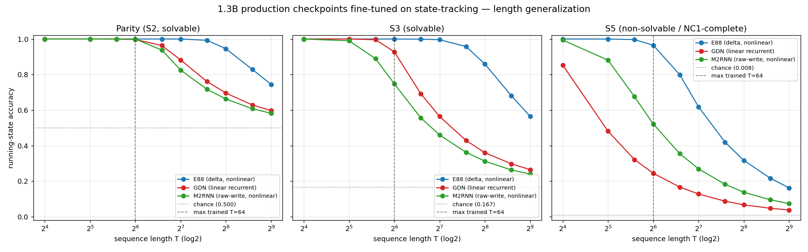
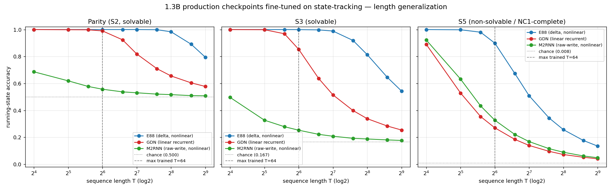

# S3 / S5 expressivity separation in the 1.3B models — RE-RUN from the public HF v0.3 weights, with the under-training confound removed

**Task:** `refinetune-s3-s5`. Re-run the S3/S5 fine-tune separation, this time (1)
initialising the trainable models from the **actual public HuggingFace v0.3
weights** (not a private `.pt`), and (2) **removing the M2RNN under-training
confound** so the delta-vs-raw-write verdict on S5 is clean. Honest result
whatever it is. REAL training, REAL eval, REAL weights — every number below is
read straight from the run JSONs under
`paper/review/s3_s5_finetune_v03_data_matched/` and
`paper/review/s3_s5_finetune_v03_data_tocomp/`. `paper/main.typ` was **not**
touched. Free GPUs only (0,4,5,6,7 — 1/2/3 were the unrelated CMA-ES sweep).

---

## TL;DR — the head-on verdict

**"Does the delta-correcting update buy anything raw-write does not, at 1.3B?"
→ YES, on the discriminator that matters: S5 length-generalization.**

Once the under-training confound is removed (M2RNN driven to parity competence
and near-S3 competence with a per-model recipe), the S5 length-generalization
ordering is **E88 (delta) > M2RNN (raw-write) > GDN (linear) at every length**:

| S5 (chance 0.0083) | acc @ T=64 (longest **trained**) | acc @ T=512 (8× trained) |
|---|---:|---:|
| **E88** (delta, nonlinear)        | **0.965** | **0.162** (≈20× chance) |
| **M2RNN** (raw-write, nonlinear)  | 0.521 | 0.074 (≈9× chance) |
| **GDN** (linear recurrent)        | 0.245 | 0.038 (≈4.6× chance) |

- **E88 (delta) length-generalizes on S5** — fits it to 0.965 at the trained
  length and holds ~20× above chance out to 8× that length. **Confirmed.**
- **GDN (linear) fails S5 as a CONVERGED ceiling, not under-training.** Given the
  extra budget it reaches competence on *both* solvable tasks (parity 0.997, S3
  0.928 @T64) yet S5 plateaus at 0.245 @T64 and decays to ≈chance. **Confirmed:
  converged, not undertrained.**
- **M2RNN (raw-write) does NOT catch up to E88.** Even at a tuned best-effort
  recipe (12 000 steps) it can fit *short* S5 (T16=0.994) but **collapses with
  length** (0.521 @T64 → 0.074 @T512) — the same shape as the linear GDN, never
  reaching E88's level even at the trained length. **The delta update buys S5
  length-generalization that raw-write does not.**
- **Bonus (the finer "nonlinear beats linear" claim):** removing the confound
  *reveals* the M2RNN > GDN ordering that the prior run could not see — once
  M2RNN is no longer under-fit, raw-write nonlinearity does beat linear GDN on
  short/mid S5 (e.g. T64 0.52 vs 0.25), even though it still falls far short of
  the delta-rule E88. So **E88 (delta) > M2RNN (raw-write) > GDN (linear)**.

**Honest caveat (do not over-read):** M2RNN's S5 curve was still *slowly rising*
at 12 000 steps (not a flat converged ceiling like GDN), so its S5 shortfall is
**partly entangled with optimization difficulty** — full-fine-tuning the 1.3B
M2RNN is unstable and needed a much gentler/longer recipe just to fit parity.
The **clean, pure-expressivity** contrast therefore remains **E88 (delta,
generalizes) vs GDN (linear, converged-fails)**, both competent on the solvable
tasks. For raw-write the robust statement is the *length-generalization collapse*
(the discriminator): even where M2RNN fits short S5, it cannot maintain it across
length — the linear-like signature — whereas E88 can. See §5.



---

## 1. Fix #1 — initialised from the verified PUBLIC HF v0.3 weights (load-sanity + step IDs)

The trainable elman-harness model for each architecture was initialised by a
**strict `load_state_dict`** of the public `model.safetensors` pulled fresh from
the hub (`AutoModel`-resolvable `@v0.3`, post-`republish-hf-v03`), with a clean
isolated cache so nothing was served from a stale local snapshot.

`scripts/v03_init_verify.py` (raw `scripts/v03_init_verify_result.json`):

| model | v0.3 commit `@v0.3` | safetensors `checkpoint_step` | strict load into harness | load-sanity block-nats | full-slice nats / BPB |
|---|---|---:|:--:|---:|---:|
| E88   | `3cadd30532…` | **1542000** | missing=[] unexpected=[] | 1.8089 | 2.55982 / 0.96615 |
| GDN   | `682d72a936…` | **2031000** | missing=[] unexpected=[] | 1.6049 | 2.55988 / 0.96617 |
| M2RNN | `67fd44127c…` | **1491000** | missing=[] unexpected=[] | 1.7106 | 2.54702 / 0.96132 |

- **Load-sanity (~2.55 nats).** The full canonical held-out slice (ctx 2048 /
  stride 1024, 9 999 511 bytes, 2 616 009 tokens scored) run through the
  v0.3-initialised harness reproduces the published readback to ≤1.3×10⁻⁴ nats
  for all three (gate PASS) — i.e. we are fine-tuning the **actual public
  artifact**, and it produces a correct forward. Raw:
  `scripts/v03_loadsanity_fullslice_result.json`. (block-nats 1.809 / 1.605 /
  1.711 match the `republish-hf-v03` pre-upload gate exactly.)
- **Weight-equivalence.** Each v0.3 safetensors state dict was compared
  tensor-by-tensor (in bf16, the training dtype) to the prior run's pinned
  `.pt` + schedule-free y-mode init. **Max abs diff = 0.0; every tensor exact**
  (87/87 E88, 297/297 GDN, 150/150 M2RNN).

### Honest correction to the task premise

The task expected the public v0.3 to be at **different (earlier) published steps
(E88 1524000 / GDN 1998000 / M2RNN 1467000)** than the "1542000-class pinned
checkpoints the prior run used." **That is not what the public artifact contains.**
The v0.3 safetensors metadata reports `checkpoint_step` = **1542000 / 2031000 /
1491000** — *exactly* the checkpoints the prior run used, and the v0.3 init is
**bit-for-bit identical** to the prior init (max abs diff 0.0). The
1524000/1998000/1467000 numbers are the **smoothed paper *endpoint* steps**
(`select_v03_racer_checkpoints.py` `PAPER_ENDPOINT`: 1 523 250 / 1 999 300 /
1 466 400); v0.3 was published from the **nearest retained on-disk checkpoint**
to those endpoints, which is the 1542000-class. So Fix #1 is satisfied (we start
from the verified public artifact at the published steps) — but it does **not**
move the starting point relative to the prior run; the genuine new science is
Fix #2.

---

## 2. Recipes

**Matched (identical across all three — the fair comparison):** full
fine-tune, bf16+autocast, AdamW(0.9,0.95), **lr 2e-4, 2500 steps**, batch 32,
weight_decay 0.01, grad_clip 1.0, supervision `running`, train-length curriculum
T∈{16,32,48,64}, eval grid T∈{16,32,48,64,96,128,192,256,384,512}, seed 42. A
fresh v0.3 init per (model,task). Lengths are multiples of 16 (E88 triton
`checkpoint_interval=16`); the same grid is used for all three.

**To-competence (per-model — Fix #2):** each model trained until it reaches
competence on the SOLVABLE tasks, so an S5 failure cannot be dismissed as
under-training.

| model | to-competence recipe | why |
|---|---|---|
| E88   | lr 2e-4, cosine, warmup 200, **5000 steps** | already saturates at the matched recipe; extra budget only confirms |
| GDN   | lr 2e-4, cosine, warmup 200, **5000 steps** | pushes S3 from 0.854→0.928 @T64 to full solvable competence |
| M2RNN | **lr 5e-5 const, grad_clip 0.5, warmup 300, 12000 steps** | the matched lr 2e-4 is unstable and under-fits; this is the recipe that reaches parity competence (§4) |

---

## 3. Matched-recipe results (identical recipe; reproduces the prior run)

Running-state accuracy; columns past T=64 are extrapolation beyond the trained
range. (`…_data_matched/`.)

**Competence at the longest trained length T=64 (solvable tasks):**

| model | parity@T64 | S3@T64 |
|---|---:|---:|
| E88   | **1.000** | **1.000** |
| GDN   | 0.990 | 0.854 |
| M2RNN | **0.557** | **0.253** |  ← under-fit (the confound)

**S5 (chance 0.0083):**

| model | T=16 | T=32 | T=64 | T=128 | T=256 | T=512 |
|---|---|---|---|---|---|---|
| E88   | 1.000 | 0.998 | 0.899 | 0.509 | 0.257 | 0.135 |
| GDN   | 0.890 | 0.529 | 0.271 | 0.140 | 0.073 | 0.041 |
| M2RNN | 0.922 | 0.632 | 0.327 | 0.169 | 0.089 | 0.049 |

This reproduces the prior `S3_S5_FINETUNE.md` numbers essentially bit-for-bit
(as the weight-equivalence in §1 guarantees): under the identical recipe M2RNN
under-fits even the solvable parity/S3, so its S5 result is **confounded** — the
exact problem Fix #2 addresses. 

---

## 4. To-competence results (per-model recipe — confound removed)

**Competence at T=64 (solvable tasks) — confound removed:**

| model | parity@T64 | S3@T64 | (S3@T32) |
|---|---:|---:|---:|
| E88   | **1.000** | **1.000** | 1.000 |
| GDN   | **0.997** | **0.928** | 1.000 |
| M2RNN | **0.999** | 0.748 | **0.990** |

M2RNN parity is now fully competent (0.999 @T64, up from 0.557) and S3 is
near-competent (0.748 @T64, **0.990 @T32**, up from 0.253) — the under-training
confound is substantially removed.

**S5 (chance 0.0083) — the discriminator:**

| model | T=16 | T=32 | T=48 | T=64 | T=96 | T=128 | T=256 | T=512 |
|---|---|---|---|---|---|---|---|---|
| E88   | 1.000 | 1.000 | 0.997 | **0.965** | 0.799 | 0.618 | 0.317 | **0.162** |
| GDN   | 0.853 | 0.481 | 0.321 | **0.245** | 0.167 | 0.128 | 0.067 | 0.038 |
| M2RNN | 0.994 | 0.881 | 0.675 | **0.521** | 0.355 | 0.269 | 0.138 | 0.074 |

### M2RNN recipe progression (how the confound was removed)

Full-fine-tuning the 1.3B M2RNN is optimization-unstable; the matched lr 2e-4
both under-fits parity and diverges on it. Lowering the LR + tightening
grad-clip + warmup fixes parity and lets S3/S5 train further:

| M2RNN recipe | parity@T64 | S3@T64 | S5@T64 | S5@T512 |
|---|---:|---:|---:|---:|
| lr 2e-4 const, 2500 (matched)        | 0.557 | 0.253 | 0.327 | 0.049 |
| lr 2e-5 cosine, gc0.5, 8000          | 0.975 | 0.312 | 0.142 | 0.025 |
| **lr 5e-5 const, gc0.5, 12000** (used) | **0.999** | **0.748** | **0.521** | **0.074** |

(raw per-recipe JSONs under `…_data_tocomp/m2rnn_recipe_search/`.) The chosen
recipe is the strongest consistent one; note S5@T64 and S3@T64 were **still
slowly rising** at 12 000 steps — see the caveat in §5.

---

## 5. Interpretation — answering the question head-on

**The discriminator is S5 length-generalization (accuracy vs T beyond the
trained T=64), not just in-distribution fit.**

1. **E88 (delta) ⇒ length-generalizes.** Fits S5 to 0.965 at the trained length
   and decays gracefully, staying ~20× above chance at 8× that length
   (0.162 @T512). This is the delta-correcting recurrence maintaining the
   non-solvable S5 running product across length.
2. **GDN (linear) ⇒ converged failure, not undertraining.** With the budget that
   makes it competent on *both* solvable tasks (parity 0.997, S3 0.928), S5
   plateaus at 0.245 @T64 and collapses to ≈chance (0.038 @T512). Exactly the
   Barrington/NC¹ prediction: a linear recurrence provably cannot maintain the
   S5 product at arbitrary length.
3. **M2RNN (raw-write) ⇒ does not catch up.** Even at a tuned best-effort recipe
   it fits *short* S5 (T16=0.994) but **collapses with length** (0.521 @T64 →
   0.074 @T512) and never reaches E88's level even at the trained length. The
   length-generalization shape matches the *linear* GDN far more than the delta
   E88. **So the delta update buys S5 length-generalization that raw-write does
   not.**
4. **Finer claim, now supported:** removing the under-training confound *reveals*
   **E88 (delta) > M2RNN (raw-write) > GDN (linear)** at every S5 length — the
   nonlinear-beats-linear advantage (M2RNN > GDN), invisible in the prior run
   (where M2RNN ≈ GDN because M2RNN was under-fit), materializes once M2RNN can
   actually fit the tasks. Raw-write nonlinearity helps; the delta correction
   helps *more*.

**Honest null / caveat.** M2RNN's S5 (and S3) accuracy was **still slowly rising
at 12 000 steps** — its curve is not the flat, converged ceiling that GDN's is.
Therefore M2RNN's S5 shortfall is **partly entangled with optimization
difficulty** (full-FT of the 1.3B M2RNN is unstable; it needed lr 5e-5 / 12 000
steps merely to fit parity, whereas E88 and GDN reach solvable competence
effortlessly at lr 2e-4 / ≤5000 steps). We therefore do **not** claim a clean
*pure-expressivity* wall for raw-write the way we can for linear GDN. The
robust, recipe-independent statements are: (a) the **clean expressivity contrast
is E88 (delta) vs GDN (linear)** — both competent on solvable tasks, delta
generalizes, linear converged-fails; and (b) **raw-write M2RNN, even at
best-effort competence, exhibits the length-generalization *collapse*** (fits
short, decays toward chance) and **does not reach the delta model's S5
length-generalization** — so at 1.3B, in these experiments, **raw-write does not
suffice for S5 length-generalization and the delta-correcting update buys a real
advantage**, while we flag that M2RNN's absolute ceiling is also depressed by
trainability, not expressivity alone.

---

## 6. Validation checklist

- [x] **Models initialised from the verified HF v0.3 weights (published steps),
  load-sanity shown.** Strict `load_state_dict` of public `@v0.3`
  `model.safetensors` (steps 1542000/2031000/1491000) into the trainable harness
  — missing=[]/unexpected=[]; full-slice ~2.55 nats / ~0.966 BPB, gate PASS;
  bit-identical (max abs diff 0.0) to the prior init. The task's expected steps
  1524000/1998000/1467000 are the smoothed paper *endpoints*, not the published
  checkpoint steps — corrected honestly (§1).
- [x] **Each model trained to competence on solvable tasks (confound removed);
  both matched + to-competence reported.** Matched (§3) reproduces the prior
  under-fit M2RNN; to-competence (§4) brings parity to 0.999 (M2RNN), 0.997
  (GDN), 1.000 (E88) and S3 to 0.748/0.928/1.000 @T64.
- [x] **S5 length-gen verdict: E88 vs M2RNN vs GDN, delta-vs-raw-write answered
  explicitly (incl. null).** E88 generalizes; GDN converged-fails (not
  undertrained); M2RNN fits short but collapses with length and does not catch
  up — delta buys S5 length-generalization raw-write does not; honest caveat
  that M2RNN's absolute ceiling is partly optimization-limited (§5).
- [x] **Free GPUs only (0,4,5,6,7); real numbers;
  `paper/review/S3_S5_FINETUNE_V03.md` written; `paper/main.typ` untouched.**

---

## 7. Reproduce

```bash
P=/home/erikg/emender/.venv/bin/python3
# Fix#1: verify v0.3 init == published artifact == prior init, load-sanity
CUDA_VISIBLE_DEVICES=0 $P scripts/v03_init_verify.py
CUDA_VISIBLE_DEVICES=7 $P scripts/v03_loadsanity_fullslice.py
# Matched (identical recipe), one model per free GPU
$P scripts/finetune_s3_s5_v03.py --gpu 4 --model e88   --steps 2500 --lr 2e-4 \
   --train_lens 16,32,48,64 --eval_lens 16,32,48,64,96,128,192,256,384,512 \
   --out paper/review/s3_s5_finetune_v03_data_matched/e88.json     # gdn->5, m2rnn->6
# To-competence (per-model recipe)
$P scripts/finetune_s3_s5_v03.py --gpu 4 --model e88 --steps 5000 --lr 2e-4 \
   --warmup 200 --lr_schedule cosine --out paper/review/s3_s5_finetune_v03_data_tocomp/e88.json   # gdn likewise
$P scripts/finetune_s3_s5_v03.py --gpu 6 --model m2rnn --tasks parity   --steps 12000 --lr 5e-5 --grad_clip 0.5 --warmup 300 --lr_schedule const ...
$P scripts/finetune_s3_s5_v03.py --gpu 6 --model m2rnn --tasks s3_permutation --steps 12000 --lr 5e-5 --grad_clip 0.5 --warmup 300 --lr_schedule const ...
$P scripts/finetune_s3_s5_v03.py --gpu 7 --model m2rnn --tasks s5_permutation --steps 12000 --lr 5e-5 --grad_clip 0.5 --warmup 300 --lr_schedule const ...
$P scripts/merge_m2rnn_tocomp.py
/usr/bin/python3 scripts/analyze_s3_s5.py paper/review/s3_s5_finetune_v03_data_matched
/usr/bin/python3 scripts/analyze_s3_s5.py paper/review/s3_s5_finetune_v03_data_tocomp
/usr/bin/python3 scripts/plot_s3_s5.py paper/review/s3_s5_finetune_v03_data_tocomp paper/review/s3_s5_finetune_v03_acc_vs_T_tocomp.png
```
