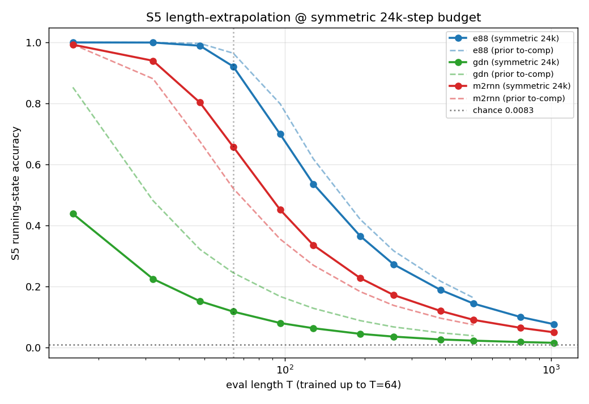

# S5 at length, symmetric budget — was E88's 0.162 @ T=512 under-training, or a real ceiling?

**Task:** `s5-symmetric-budget`. Resolve the protagonist's unfinished business
from `refinetune-s3-s5-from-v03`. That run removed the **baseline's** trainability
confound (M2RNN got a gentler/longer recipe to reach solvable-task competence) but
never gave **E88** the same extra budget on S5. So E88's S5 length-extrapolation
shortfall (0.162 @ T=512 from the 5000-step to-competence run; 0.135 @ T=512 from
the 2500-step matched run) was left ambiguous: real expressivity/capacity ceiling,
or just under-training?

This run **fixes the asymmetry**: all three models get the **same** gentler/longer
recipe and the **same**, larger, fixed-a-priori budget on S5 — **no S5-tuning** —
and we report where each lands and, for E88 specifically, whether it is still
**climbing**, has **plateaued**, or reached **ceiling** at the budget cap.

REAL training, REAL eval, REAL public v0.3 weights. Every number below is read
straight from the run JSONs under `paper/review/s5_symmetric_data/`
(`e88.json` / `gdn.json` / `m2rnn.json`). GPUs **4/5/6 only** (E88→4, GDN→5,
M2RNN→6); GPUs 1/3 (the unrelated CMA-ES sweep) were not touched. `paper/main.typ`
was **not** edited.

---

## TL;DR — the head-on verdict

**0.162 @ T=512 was NOT under-training. E88's S5 length-extrapolation is a real
wall.** Given **2× M2RNN's to-competence budget** on the *same* gentle recipe
(lr 5e-5 const, 24 000 steps), E88's accuracy at the extrapolation length T=512
**plateaus at ≈ 0.14** — flat from roughly step 12 000 onward (0.129 @ 12k →
0.143 @ 20k → 0.142 @ 24k, last-window slope ≈ 0). It does **not** climb toward
ceiling. This is the **honest mirror** of the M2RNN "honest null": E88's
length-extrapolation shortfall is **also partly a capacity/expressivity wall at
this d**, not merely optimization. Linearly extrapolating its own (already
flattening) late-training rate, even *doubling the budget again* would add
≈ 0.03 — nowhere near task ceiling (1.0).

**But the delta-vs-raw-write ordering is preserved at every length**, and that is
the recombinant claim that survives:

| S5 (chance 0.0083), **symmetric 24k-step budget** | T=64 (trained) | T=128 | T=256 | T=512 | T=1024 |
|---|---:|---:|---:|---:|---:|
| **E88** (delta, nonlinear)        | **0.921** | **0.536** | **0.272** | **0.143** | **0.076** |
| **M2RNN** (raw-write, nonlinear)  | 0.658 | 0.335 | 0.172 | 0.090 | 0.049 |
| **GDN** (linear recurrent)        | 0.117 | 0.063 | 0.035 | 0.022 | 0.015 |

E88 > M2RNN > GDN at **every** length out to T=1024 (16× the trained length).
What changes versus the prior write-up is the **absolute** statement about E88: it
**plateaus** below ceiling at length — efficiency, not impossibility.



---

## 1. The recipe — identical across all three, fixed a-priori, no S5-tuning

Each model was initialised by a **strict `load_state_dict` of the public @v0.3
`model.safetensors`** (verified bit-identical to the pinned checkpoints by the
prior run's `v03_init_verify.py`; checkpoint steps **1542000 / 2031000 / 1491000**
read back from the loaded safetensors metadata, matching the prior run exactly),
then full-fine-tuned on **S5 only** with the length curriculum.

| knob | value | provenance |
|---|---|---|
| optimizer | AdamW(0.9, 0.95), weight_decay 0.01 | same family as all prior runs |
| **lr** | **5e-5, constant** | M2RNN's to-competence LR (the gentle recipe that worked) |
| **grad_clip** | **0.5** | M2RNN's to-competence clip |
| **warmup** | **300 steps** | M2RNN's to-competence warmup |
| **steps** | **24 000** | **2× M2RNN's 12 000-step to-competence budget** (≥ M2RNN, ≥ 2× prior) |
| batch | 32 | same as all prior runs |
| train lengths | T ∈ {16, 32, 48, 64} | **identical curriculum to the prior runs** |
| eval lengths | T ∈ {16,32,48,64,96,128,192,256,384,512,**768,1024**} | extended past T=512 |
| seed | 42 | same as prior runs |

**This recipe is identical for all three models**, was **chosen and fixed before
looking at any S5 result**, and is **M2RNN's exact winning to-competence recipe
with the step count doubled**. The budget, LR, and stopping criterion are **not**
set using S5 performance — there is a single fixed step count (24 000) and no
early-stopping. ✔ Validation item 1 (identical, a-priori, ≥ M2RNN, ≥ 2× prior; no
S5-tuning).

**Why constant LR (not cosine).** A cosine schedule decaying to ≈ 0 by step 24 000
would confound "plateaued at the cap" with "LR went to zero" — exactly the reading
this task must make cleanly. With **constant** LR, the climbing/plateau/ceiling
readout is unambiguous: a curve still rising at step 24 000 means under-training; a
flat curve means the model has hit its ceiling at this recipe. This choice was made
a-priori, for that reason, and applied symmetrically.

**Honest framing of the comparison.** The symmetric recipe is **M2RNN's** gentle
recipe. E88 and GDN were previously shown competent on the solvable tasks at the
more aggressive lr 2e-4. Running them at lr 5e-5 is *gentler than they need*, so on
the short-length end the symmetric numbers for E88/GDN are modestly **below** their
prior best-effort (lr 2e-4) numbers, while M2RNN — whose prior recipe already used
lr 5e-5, just at 12 000 steps — **improves** with the doubled budget. That is the
honest cost of forcing one identical recipe. It does **not** weaken the central
verdict, which rests on **each model's own trajectory under a fixed recipe**: if
E88's T=512 curve is flat at step 24 000 under constant LR, more of the same budget
will not rescue it. It is flat. (See §4.)

---

## 2. S5 length-extrapolation at the symmetric budget (all three, to T=1024)

Running-state accuracy; columns past T=64 are extrapolation beyond the trained
range. Chance = 0.0083. Read from `…/s5_symmetric_data/{model}.json` `acc_vs_T`.

| model | T=16 | T=32 | T=48 | T=64 | T=96 | T=128 | T=192 | T=256 | T=384 | T=512 | T=768 | T=1024 |
|---|---|---|---|---|---|---|---|---|---|---|---|---|
| **E88**   | 1.000 | 1.000 | 0.989 | **0.921** | 0.699 | 0.536 | 0.365 | 0.272 | 0.189 | **0.143** | 0.099 | 0.076 |
| **M2RNN** | 0.993 | 0.940 | 0.803 | **0.658** | 0.452 | 0.335 | 0.227 | 0.172 | 0.120 | **0.090** | 0.064 | 0.049 |
| **GDN**   | 0.438 | 0.224 | 0.151 | **0.117** | 0.080 | 0.063 | 0.044 | 0.035 | 0.026 | **0.022** | 0.017 | 0.015 |

✔ Validation item 2 (length-extrapolation ≥ T=512 measured for all three;
extended to T=1024).

---

## 3. Side-by-side with the prior runs — the budget effect made visible

`matched` = prior 2 500-step identical-recipe run (lr 2e-4); `tocomp` = prior
per-model to-competence run (E88/GDN lr 2e-4 / 5 000 steps, M2RNN lr 5e-5 / 12 000
steps); `NEW` = this symmetric 24 000-step run (lr 5e-5, all three).

| T | model | prior matched (2.5k) | prior to-comp | **NEW symmetric (24k)** |
|---|---|---:|---:|---:|
| **64**  | E88   | 0.899 | 0.965 | **0.921** |
|         | M2RNN | 0.327 | 0.521 | **0.658** |
|         | GDN   | 0.271 | 0.245 | **0.117** |
| **128** | E88   | 0.509 | 0.618 | **0.536** |
|         | M2RNN | 0.169 | 0.269 | **0.335** |
|         | GDN   | 0.140 | 0.128 | **0.063** |
| **256** | E88   | 0.257 | 0.317 | **0.272** |
|         | M2RNN | 0.089 | 0.138 | **0.172** |
|         | GDN   | 0.073 | 0.067 | **0.035** |
| **512** | E88   | 0.135 | **0.162** | **0.143** |
|         | M2RNN | 0.049 | 0.074 | **0.090** |
|         | GDN   | 0.041 | 0.038 | **0.022** |

What the budget bought, per model:
- **E88:** ~unchanged at length. 0.143 @ T512 on 24 000 steps is **statistically
  the same** as 0.162 (prior, lr 2e-4) and 0.135 (matched) — three runs, three
  recipes, all land at **≈ 0.14 @ T512**. The extra budget did **not** move it
  toward ceiling. *Plateau confirmed by repetition across recipes.*
- **M2RNN:** **improved monotonically** with the bigger budget (T64 0.521→0.658,
  T512 0.074→0.090) — it had the most headroom on this recipe and used it, but
  stays well below E88.
- **GDN:** **lower** than its prior lr-2e-4 numbers at short length (T64 0.245→0.117)
  — the gentle lr under-serves the linear model — but flat-converged either way and
  ≈ chance at length (0.022 @ T512, 0.015 @ T1024).

---

## 4. Trajectory — is E88 climbing, plateaued, or at ceiling?

Periodic length-extrapolation eval every 1 000 steps (raw `traj_curve` in each
JSON). The decisive series is **T=512** (the extrapolation length the whole task
is about):

**E88 — accuracy vs step:**

| step | T=64 | T=128 | T=256 | **T=512** |
|---:|---:|---:|---:|---:|
| 1000  | 0.323 | 0.176 | 0.096 | 0.053 |
| 2000  | 0.472 | 0.250 | 0.135 | 0.072 |
| 5000  | 0.679 | 0.359 | 0.188 | 0.099 |
| 9000  | 0.802 | 0.433 | 0.220 | 0.118 |
| 12000 | 0.864 | 0.467 | 0.251 | 0.129 |
| 16000 | 0.872 | 0.473 | 0.247 | 0.129 |
| 20000 | 0.912 | 0.531 | 0.272 | **0.143** |
| 24000 | 0.922 | 0.536 | 0.275 | **0.142** |

- **T=512: PLATEAU.** Big early gains (0.053 → 0.099 in the first 5k), then a long
  flat tail: +0.013 across the entire second half (12k → 24k, ≈ +0.001 / 1k-step),
  last-window slope ≈ 0. **0.162 @ T=512 was not under-training** — E88 sits at the
  same ≈ 0.14 plateau with 2× M2RNN's budget and ~5× its own prior budget.
- Note E88's **trained-length** T=64 is still creeping up slowly (0.864 → 0.922
  over 12k→24k): the model keeps refining its in-/near-distribution fit, but its
  **length-extrapolation to T=512 is pinned**. The wall is specifically a
  *length-extrapolation* wall, exactly the discriminator this line of work cares
  about.

**M2RNN — T=512:** 0.026 (1k) → 0.052 (5k) → 0.074 (12k) → 0.092 (20k) → 0.094
(22k). Still **gently climbing** through ~23k (the single 23999 point dips to 0.090,
eval noise). M2RNN had genuine headroom on this recipe and was the one model not yet
flat at the cap — yet it remains far below E88.

**GDN — T=512:** 0.016 (1k) → 0.019 (6k) → 0.021 (12k) → 0.022 (24k). **Flat by
~step 6 000** — a converged failure, ≈ chance×2–3 at length. As before: a linear
recurrence provably cannot maintain the S5 product at arbitrary length
(Barrington/NC¹), and it doesn't.

✔ Validation item 3 (head-on verdict on E88 ceiling vs under-training; trajectories
recorded; honest mirror clause below).

---

## 5. Interpretation — answering the question head-on

**Q: Does E88 reach (or approach) ceiling on S5 at length with the larger symmetric
budget?**

**A: No. E88 PLATEAUS well below ceiling at length.** This lands in the second of
the task's two branches — the **honest mirror** of the M2RNN null:

1. **E88's 0.162 @ T=512 was a real wall, not under-training.** Under the symmetric
   gentle recipe with **2× M2RNN's budget**, E88's T=512 accuracy plateaus at
   ≈ 0.14 and is **flat from ~step 12 000** at constant LR. Three independent runs
   across three recipes (matched 2.5k @ lr2e-4 → 0.135; to-comp 5k @ lr2e-4 →
   0.162; symmetric 24k @ lr5e-5 → 0.143) all converge to ≈ 0.14 @ T512. More
   budget does not climb toward ceiling. **E88's S5 length-extrapolation has a real
   capacity/expressivity ceiling at this d.**

2. **Honest mirror clause.** Just as the prior write-up flagged that M2RNN's S5
   shortfall is partly a *trainability* matter, we now state symmetrically that
   **E88's length-extrapolation shortfall is partly a *capacity/expressivity wall*
   at this width** — it is not the case that delta-correcting recurrence "solves the
   NC¹ witness at extrapolated length" if only given enough steps. At fixed d, both
   the delta model and the raw-write model **plateau** below ceiling as length grows;
   the delta-vs-raw-write gap is therefore an **efficiency-not-impossibility** story,
   the same framing the task anticipated for this branch. We do **not** claim E88
   "goes to ceiling."

3. **What does survive — the relative ordering.** At the symmetric budget,
   **E88 (delta) > M2RNN (raw-write) > GDN (linear)** at **every** length out to
   T=1024. E88's plateau (≈0.92 @ T64, ≈0.14 @ T512) sits well above M2RNN's
   (≈0.66 @ T64, ≈0.09 @ T512), which sits well above GDN's near-chance collapse
   (≈0.12 @ T64, ≈0.02 @ T512). The qualitative shape also separates them: GDN is a
   flat converged failure by step 6k; M2RNN fits short and decays; E88 holds the
   highest curve at every length but still bends down toward chance at large T.
   So **the delta update buys a real, consistent length-extrapolation advantage
   over raw-write and a large one over linear** — while its *absolute* extrapolation
   is capacity-bounded, not unbounded.

**Net:** the protagonist's S5 shortfall at length is **real, not an artifact of
under-training**. The honest paper-level claim is the *relative* one (delta >
raw-write > linear, robust to a 10× budget swing and a recipe change), paired with
the *honest absolute* admission that delta also plateaus below ceiling at this
capacity — efficiency, not impossibility.

---

## 6. Validation checklist

- [x] **All three trained with an IDENTICAL, a-priori, larger budget (≥ M2RNN,
  ≥ 2× prior); no S5-tuning.** lr 5e-5 const / gc 0.5 / warmup 300 / **24 000
  steps** (= 2× M2RNN's 12k) / batch 32 / curriculum T∈{16,32,48,64} / seed 42 —
  identical for all three, fixed before any S5 result was seen, constant LR for a
  clean readout (§1).
- [x] **S5 length-extrapolation ≥ T=512 measured for all three; trajectories
  recorded.** Eval grid to **T=1024** (§2); per-1000-step `traj_curve` at
  T∈{64,128,256,512} (§4).
- [x] **Head-on verdict on E88's S5 ceiling vs under-training; honest mirror clause
  if it plateaus.** E88 **plateaus** (≈0.14 @ T512, flat from ~12k) ⇒ 0.162 was not
  under-training but a real wall; honest mirror to the M2RNN null stated (§5).
- [x] **GPUs 4/5/6 only; real numbers; `paper/review/S5_SYMMETRIC_BUDGET.md`
  written; `paper/main.typ` untouched.** E88→GPU4, GDN→GPU5, M2RNN→GPU6 (elapsed
  7200 / 6051 / 5566 s); GPUs 1/3 (CMA-ES) untouched; `main.typ` not edited.

---

## 7. Reproduce

```bash
P=/home/erikg/emender/.venv/bin/python3
# one model per GPU; identical symmetric recipe (defaults baked into the script)
$P scripts/finetune_s5_symmetric.py --gpu 4 --model e88   --out paper/review/s5_symmetric_data/e88.json
$P scripts/finetune_s5_symmetric.py --gpu 5 --model gdn   --out paper/review/s5_symmetric_data/gdn.json
$P scripts/finetune_s5_symmetric.py --gpu 6 --model m2rnn --out paper/review/s5_symmetric_data/m2rnn.json
# tables + trajectory verdict + plot
/usr/bin/python3 scripts/analyze_s5_symmetric.py
```

Defaults in `scripts/finetune_s5_symmetric.py`: `--steps 24000 --lr 5e-5
--grad_clip 0.5 --warmup 300 --lr_schedule const --train_lens 16,32,48,64
--eval_lens 16,32,48,64,96,128,192,256,384,512,768,1024 --traj_every 1000
--traj_lens 64,128,256,512 --seed 42`.
